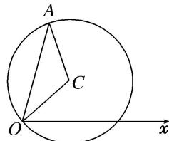

> [!faq]- 《专题2 参数方程及其应用(综合型)-坐标系与参数方程（文理通用）》例题解析
>
> > [!success]- **【答案】** 详见解析
>
> > [!note]- **【解析】**
> > 解析
> > (1)如图, 设圆 $C$ 上任意一点 $A(\rho, \theta)$ , 则 $\angle AOC = \theta - \frac{\pi}{3}$ 或 $\frac{\pi}{3} - \theta$ .
> >
> > 由余弦定理得， $4+\rho^{2}-4\rho\cos\theta-\frac{\pi}{3}=4$
> >
> > 所以圆 C 的极坐标方程为 $\rho=4\cos\left(\theta-\frac{\pi}{3}\right)$ .
> >
> > 
> >
> > (2)在直角坐标系中，点 $C$ 的坐标为 $(1, \sqrt{3})$ ，可设圆 $C$ 上任意一点 $P(1 + 2\cos \alpha, \sqrt{3} + 2\sin \alpha)$ ，又令 $M(x, y)$ ，由 $Q(5, -\sqrt{3})$ ， $M$ 是线段 $PQ$ 的中点，
> >
> > 得点 $M$ 的轨迹的参数方程为 $\left\{ \begin{array}{l}x = \frac{6 + 2\cos\alpha}{2},\\ y = \frac{2\sin\alpha}{2} \end{array} \right.$ （α为参数），即 $\left\{ \begin{array}{ll}x = 3 + \cos \alpha ,\\ y = \sin \alpha \end{array} \right.$ （α为参数），
> >
> > ∴点 M 的轨迹的普通方程为 $(x-3)^{2}+y^{2}=1$ .
