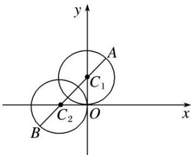

> [!faq]- 《专题3 转化为普通方程问题》例题解析
>
> > [!success]- **【答案】** 详见解析
>
> > [!note]- **【解析】**
> > 解析
> > (1)由 $\left\{ \begin{array}{l} x = 2\cos \theta, \\ y = 2 + 2\sin \theta, \end{array} \right.$ 得 $\left\{ \begin{array}{l} x = 2\cos \theta, \\ y - 2 = 2\sin \theta, \end{array} \right.$ 两式平方相加，得 $x^{2} + (y - 2)^{2} = 4$ ，即 $x^{2} + y^{2} - 4y = 0$ 。
> > - **①**：由 $\rho = -4\cos \theta$ ，得 $\rho^2 = -4\rho \cos \theta$ ，即 $x^{2} + y^{2} = -4x$ 。
> > - **②**：①-②得 $x + y = 0$ ，代入①得交点为(0，0)，(-2，2)。其极坐标为(0，0)， $\left[2\sqrt{2}, \frac{3\pi}{4}\right]$
> > (2)如图。由平面几何知识可知， $A, C_1, C_2, B$ 依次排列且共线时 $|AB|$ 最大，此时 $|AB| = 2\sqrt{2} + 4$ ，点 $O$ 到 $AB$ 的距离为 $\sqrt{2}$ 。∴△OAB的面积为 $S = \frac{1}{2} \times (2\sqrt{2} + 4) \times \sqrt{2} = 2 + 2\sqrt{2}$
> >
> > 
