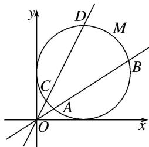

> [!faq]- 《专题4 过极点的射线上线段长度及与长度相关的问题-坐标系与参数方程（文理通用）》例题解析
>
> > [!success]- **【答案】** 详见解析
>
> > [!note]- **【分析】**
> > 本题未单列分析。
>
> > [!note]- **【解析】**
> > (1)求 $l_{1}$ 和 M 的极坐标方程;
> > (2)当 $\alpha=\left\{0,\frac{\pi}{6}\right]$ 时，求点O到A，B，C，D四点的距离之和的最大值.
> > [规范解答] (1)依题意知，直线 $l_{1}$ 的极坐标方程为 $\theta=\alpha(\rho\in\mathbf{R})$ ,
> > 
> > 由 $\left\{ \begin{array}{l} x = 1 + \cos \varphi, \\ y = 1 + \sin \varphi, \end{array} \right.$ 消去 $\varphi$ ，得 $(x - 1)^2 + (y - 1)^2 = 1$ ，将 $x = \rho \cos \theta, y = \rho \sin \theta$ 代入上式，得 $\rho^2 - 2\rho \cos \theta - 2\rho \sin \theta + 1 = 0$ ，故 $M$ 的极坐标方程为 $\rho^2 - 2\rho \cos \theta - 2\rho \sin \theta + 1 = 0$ .
> > (2)依题意可设 $A(\rho_1, \alpha)$ , $B(\rho_2, \alpha)$ , $C\left[\rho_3, \alpha + \frac{\pi}{6}\right]$ , $D\left[\rho_4, \alpha + \frac{\pi}{6}\right]$ , 且 $\rho_1, \rho_2, \rho_3, \rho_4$ 均为正数，将 $\theta = \alpha$ 代入 $\rho^2 - 2\rho \cos \theta - 2\rho \sin \theta + 1 = 0$ ，得 $\rho^2 - 2(\cos \alpha + \sin \alpha)\rho + 1 = 0$
> > 所以 $\rho_{1} + \rho_{2} = 2(\cos \alpha +\sin \alpha)$ ，同理可得， $\rho_3 + \rho_4 = 2\left[\cos \left(\alpha +\frac{\pi}{6}\right) + \sin \left(\alpha +\frac{\pi}{6}\right)\right],$
> > 所以点 O 到 A, B, C, D 四点的距离之和为 $\rho_{1} + \rho_{2} + \rho_{3} + \rho_{4} = 2(\cos \alpha + \sin \alpha) + 2\left[\cos\left(\alpha + \frac{\pi}{6}\right) + \sin\left(\alpha + \frac{\pi}{6}\right)\right]$ $=(1+\sqrt{3})\sin \alpha+(3+\sqrt{3})\cos \alpha=2(1+\sqrt{3})\sin\left(\alpha+\frac{\pi}{3}\right)$ ,
> > 因为 $\alpha \in \left[0, \frac{\pi}{6}\right]$ ，所以 $\alpha + \frac{\pi}{3} \in \left[\frac{\pi}{3}, \frac{\pi}{2}\right]$ ，所以当 $\sin \left[\alpha + \frac{\pi}{3}\right] = \sin \frac{\pi}{2} = 1$ ，即 $\alpha = \frac{\pi}{6}$ 时，
> > $\rho_{1}+\rho_{2}+\rho_{3}+\rho_{4}$ 取得最大值 $2+2\sqrt{3}$ ，所以点 O 到 A，B，C，D 四点距离之和的最大值为 $2+2\sqrt{3}$ .
