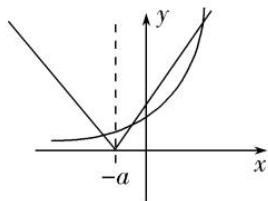

> [!faq]- 教师版例题解析
>
> > [!success]- **【答案】** (1) $\frac{1}{3}$；(2) $[2,+\infty)$；(3) 0；(4) D；(5) B；(6) $1+\ln 2$；(7) $(-\infty,-2)\cup(0,+\infty)$；(8) $(1-\ln 2,+\infty)$
>
> > [!note]- **【分析】**
> > 本题未单列分析。
>
> > [!note]- **【解析】**
> > 答案 $\frac{1}{3}$ 解析 $f(x)=3ax^{2}+\frac{1}{x}$ ，则 $f'(1)=3a+1=2$ ，解得 $a=\frac{1}{3}$ .
> > 答案 [2, +∞) 解析 直线 2x-y=0 的斜率 k=2，又曲线 $f(x)$ 上存在与直线 2x-y=0 平行的切线，∴ $f'(x)=\frac{1}{x}+4x-a=2$ 在 $(0,+\infty)$ 内有解，则 $a=4x+\frac{1}{x}-2,\quad x>0$ 。又 $4x+\frac{1}{x}\geq2\sqrt{4x\cdot\frac{1}{x}}=4$ ，当且仅当 $x=\frac{1}{2}$ 时取“=”。∴ $a\geq4-2=2$ 。∴ a 的取值范围是 $[2,+\infty)$ .
> > 答案 0 解析 依题意得 $f(x) = \frac{a}{x} + 3bx^2$ ，于是有 $\begin{cases} f(1) = -1, \\ f'(1) = \frac{1 + 1}{0 - 1}, \end{cases}$ 即 $\begin{cases} b = -1, \\ a + 3b = -2, \end{cases}$ 解得 $\begin{cases} a = 1, \\ b = -1, \end{cases}$ 所以 $a + b = 0$ .
> > 答案 D 解析 因为 $y' = ae^{x} + \ln x + 1$ ，所以 $y'|_{x=1} = ae + 1$ ，所以曲线在点 $(1, ae)$ 处的切线方程为 $y - ae = (ae + 1)(x - 1)$ ，即 $y = (ae + 1)x - 1$ ，所以 $\begin{cases} ae + 1 = 2, \\ b = -1, \end{cases}$ 解得 $\begin{cases} a = e^{-1}, \\ b = -1. \end{cases}$
> > 答案 B 解析 由题可得 $y' = \frac{-3}{(x - 2)^2}$ ，所以曲线在点(1, -2)处的切线的斜率为-3。因为切线与直线 $ax + by + c = 0$ 垂直，所以 $-3 \cdot \left(-\frac{a}{b}\right) = -1$ ，解得 $\frac{a}{b} = -\frac{1}{3}$ ，故选B.
> > 答案 $1 + \ln 2$ 解析 设切点为 $(m, m\ln m)$ , $y' = 1 + \ln x$ , $y'|_{x=m} = 1 + \ln m$ , $\therefore y - m\ln m = (1 + \ln m)(x - m)$ , 即 $y = (1 + \ln m)x - m$ , 又 $y = kx - 2$ , $\therefore \begin{cases} 1 + \ln m = k, \\ m = 2, \end{cases}$ 即 $k = 1 + \ln 2$ .
> > 答案 $(- \infty, -2) \cup (0, +\infty)$ 解析 $f'(x) = 1 - \frac{a}{2x^2}$ , 设切点坐标为 $\left[ x_0, x_0 + \frac{a}{2x_0} \right]$ , $\therefore$ 切线的斜率 $k = f'(x_0) = 1 - \frac{a}{2x_0^2}$ , $\therefore$ 切线方程为 $y - \left[ x_0 + \frac{a}{2x_0} \right] = \left[ 1 - \frac{a}{2x_0^2} \right](x - x_0)$ , 又切线过点 $(1, 0)$ , 即 $-\left[ x_0 + \frac{a}{2x_0} \right] = \left[ 1 - \frac{a}{2x_0^2} \right](1 - x_0)$ , 整理得 $2x_0^2 + 2ax_0 - a = 0$ , $\because$ 曲线存在两条切线, 故该方程有两个解, $\therefore A = 4a^2 - 8(-a) > 0$ , 解得 $a > 0$ 或 $a < -2$ .
> > 答案 $(1 - \ln 2, +\infty)$ 解析 由题意，临界情况为 $y = 2(x + a)$ 与 $y = \mathrm{e}^x$ 相切的情况， $y' = \mathrm{e}^x = 2$ ，则 $x = \ln 2$ ，所以切点坐标为 $(\ln 2, 2)$ ，则此时 $a = 1 - \ln 2$ ，所以只要 $y = 2|x + a|$ 图象向左移动，都会产生3个交点，所以 $a > 1 - \ln 2$ ，即 $a \in (1 - \ln 2, +\infty)$ .
> > 
