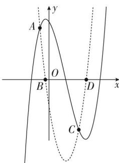
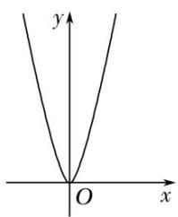
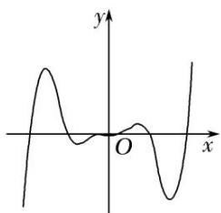
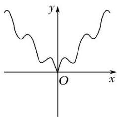
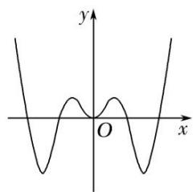

<!-- question-source:start -->
[例 1](1)定义在[-2, 2]上的函数 $f(x)$ 与其导函数 $f'(x)$ 的图象如图所示，设 O 为坐标原点，A, B, C, D 四点的横坐标依次为 $-\frac{1}{2}$ ， $-\frac{1}{6}$ ， $1, \frac{4}{3}$ ，则函数 $y = \frac{f(x)}{\mathrm{e}^x}$ 的单调递减区间是（）

A. $\left(-\frac{1}{6},\frac{4}{3}\right)$ B. $\left(-\frac{1}{2},1\right)$ C. $\left(-\frac{1}{2}, - \frac{1}{6}\right)$ D. (1, 2)

(2)已知函数 $y=f(x)$ 的导函数 $y=f'(x)$ 的图象如图所示，则函数 $y=f(x)$ 的图象可以是()

A

C

B

D

(3)函数 $f(x)=x^{2}+x\sin x$ 的图象大致为()

A

B

C

D

(4)函数 $f(x) = x + 2\sqrt{1 - x}$ 的单调递增区间是 \_\_\_\_；单调递减区间是 \_\_\_\_.

(5)设函数 $f(x) = x(\mathrm{e}^x - 1) - \frac{1}{2} x^2$ ，则 $f(x)$ 的单调递增区间是 \_\_\_\_，单调递减区间是 \_\_\_\_。

(6)函数 $y = \frac{1}{2} x^2 - \ln x$ 的单调递减区间为( )
A. $(-1, 1)$ B. $(0, 1)$ C. $(1, +\infty)$ D. $(0, +\infty)$

(7)设函数 $f(x)=2(x^{2}-x)\ln x-x^{2}+2x$ ，则函数 $f(x)$ 的单调递减区间为( )

A. $\left(0,\frac{1}{2}\right)$ B. $\left(\frac{1}{2},1\right)$ C. $(1,+\infty)$ D. $(0,+\infty)$

(8)已知定义在区间 $(0, \pi)$ 上的函数 $f(x) = x + 2\cos x$ ，则 $f(x)$ 的单调递增区间为 \_\_\_\_.

(9)函数 $f(x) = 2|\sin x| + \cos 2x$ 在 $[- \frac{\pi}{2}, \frac{\pi}{2}]$ 上的单调递增区间为（ ）A. $[- \frac{\pi}{2}, -\frac{\pi}{6}]$ 和 $[0, \frac{\pi}{6}]$ B. $[- \frac{\pi}{6}, 0]$ 和 $[\frac{\pi}{6}, \frac{\pi}{2}]$ C. $[- \frac{\pi}{2}, -\frac{\pi}{6}]$ 和 $[\frac{\pi}{6}, \frac{\pi}{2}]$ D. $[- \frac{\pi}{6}, \frac{\pi}{6}]$

(10)下列函数中，在 $(0, +\infty)$ 上为增函数的是（ ）A. $f(x) = \sin 2x$ B. $f(x) = x\mathrm{e}^{x}$ C. $f(x) = x^3 -x$ D. $f(x) = -x + \ln x$
<!-- question-source:end -->

![[高中/总复习/专题/导数/专题04 函数的单调性-导数/专题04_函数的单调性/考点一_不含参数的函数的单调性/例题选讲/例题/answers/Q00020870A1.md]]
