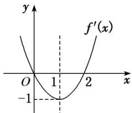
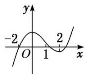
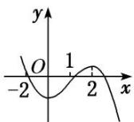
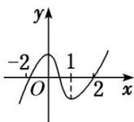
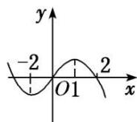

<!-- question-source:start -->
3. (多选)已知函数 $f(x)$ 的导函数 $f'(x)$ 的图象如图所示, 那么下列图象中不可能是函数 $f(x)$ 的图象的是()

A

B

C

D
<!-- question-source:end -->

![[高中/总复习/专题/导数/专题04 函数的单调性-导数/专题04_函数的单调性/考点一_不含参数的函数的单调性/对点训练/题目/answers/Q00020874A1.md]]
