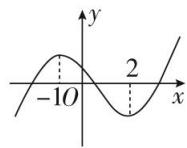
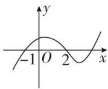
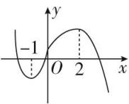
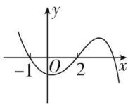

<!-- question-source:start -->
4. 函数 $f(x)$ 的导函数 $f'(x)$ 有下列信息:

① $f'(x)>0$ 时，-1<x<2；② $f'(x)<0$ 时，x<-1或x>2；③ $f'(x)=0$ 时，x=-1或x=2.

则函数 $f(x)$ 的大致图象是（ ）

A

B

C

D
<!-- question-source:end -->

![[高中/总复习/专题/导数/专题04 函数的单调性-导数/专题04_函数的单调性/考点一_不含参数的函数的单调性/对点训练/题目/answers/Q00020875A1.md]]
