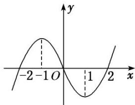

<!-- question-source:start -->
[例 3](1)在 R 上可导的函数 $f(x)$ 的图象如图所示，则关于 x 的不等式 $xf'(x)<0$ 的解集为()

A. $(- \infty, -1) \cup (0, 1)$ B. $(-1, 0) \cup (1, +\infty)$ C. $(-2, -1) \cup (1, 2)$ D. $(- \infty, -2) \cup (2, +\infty)$

(2)已知函数 $f(x)=x\sin x,\quad x\in\mathbf{R}$ ，则 $f\left(\frac{\pi}{5}\right),f(1),f\left(-\frac{\pi}{3}\right)$ 的大小关系为( )

A. $f\left(-\frac{\pi}{3}\right)>f(1)>f\left(\frac{\pi}{5}\right)$ B. $f(1)>f\left(-\frac{\pi}{3}\right)>f\left(\frac{\pi}{5}\right)$ C. $f\left(\frac{\pi}{5}\right)>f(1)>f\left(-\frac{\pi}{3}\right)$ D. $f\left(-\frac{\pi}{3}\right)>f\left(\frac{\pi}{5}\right)>f(1)$

(3)已知奇函数 $f(x)$ 是 $\mathbf{R}$ 上的增函数， $g(x) = xf(x)$ ，则（ ）A. $g\left(\log_3\frac{1}{4}\right) > g(2 - \frac{3}{2}) > g(2 - \frac{2}{3})$ B. $g\left(\log_3\frac{1}{4}\right) > g(2 - \frac{2}{3}) > g(2 - \frac{3}{2})$ C. $g(2 - \frac{3}{2}) > g(2 - \frac{2}{3}) > g\left(\log_3\frac{1}{4}\right)$ D. $g(2 - \frac{2}{3}) > g(2 - \frac{3}{2}) > g\left(\log_3\frac{1}{4}\right)$

(4)对于 $\mathbf{R}$ 上可导的任意函数 $f(x)$ ，若满足 $\frac{1 - x}{f'(x)} \leq 0$ ，则必有（ ）A. $f(0) + f(2) > 2f(1)$ B. $f(0) + f(2) \leq 2f(1)$ C. $f(0) + f(2) < 2f(1)$ D. $f(0) + f(2) \geq 2f(1)$

(5)已知函数 $f(x)=\mathrm{e}^{x}-\mathrm{e}^{-x}-2x+1$ ，则不等式 $f(2x-3)>1$ 的解集为 \_\_\_\_.

(6)设函数 $f(x)$ 为奇函数，且当 $x\geq0$ 时， $f(x)=\mathrm{e}^{x}-\cos x$ ，则不等式 $f(2x-1)+f(x-2)>0$ 的解集为( )

A. $(-∞, 1)$ B. $\left(-∞, \frac{1}{3}\right)$ C. $\left(\frac{1}{3}, +∞\right)$ D. $(1, +∞)$
<!-- question-source:end -->

![[高中/总复习/专题/导数/专题04 函数的单调性-导数/专题04_函数的单调性/考点二_比较大小或解不等式/例题选讲/例题/answers/Q00020892A1.md]]
