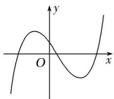
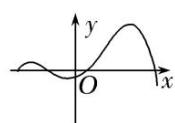
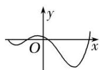
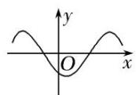
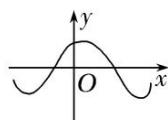

<!-- question-source:start -->
2. 函数 $y = f(x)$ 的导函数 $y = f'(x)$ 的图象如图所示，则函数 $y = f(x)$ 的图象可能是( )

A

B

C

D
<!-- question-source:end -->

![[高中/总复习/专题/导数/专题04 函数的单调性-导数/考点01_不含参数的函数的单调性/对点训练/answers/Q00040220A1.md]]
