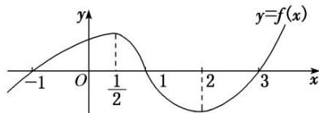

<!-- question-source:start -->
1. 已知函数 $y = f(x) (x \in \mathbf{R})$ 的图象如图所示，则不等式 $xf'(x) \geq 0$ 的解集为 \_\_\_\_.

<!-- question-source:end -->

![[高中/总复习/专题/导数/专题04 函数的单调性-导数/考点02_比较大小或解不等式/对点训练/answers/Q00040240A1.md]]
