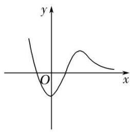
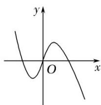
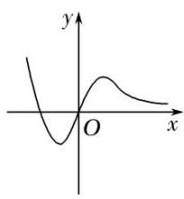
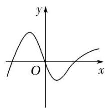
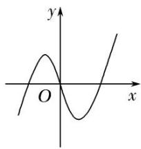

<!-- question-source:start -->
(2)已知函数 $y=f(x)$ 的导函数 $y=f'(x)$ 的图象如图所示，则函数 $y=f(x)$ 的图象可以是()

A

C

B

D
<!-- question-source:end -->

![[高中/总复习/专题/导数/专题04 函数的单调性-导数/考点一_不含参数的函数的单调性/例题选讲/例题/answers/Q00034797A1.md]]
