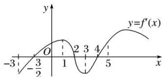

<!-- question-source:start -->
1. 如图是函数 $y = f(x)$ 的导函数 $y = f'(x)$ 的图象，则下列判断正确的是()

A. 在区间 $(-2, 1)$ 上 $f(x)$ 单调递增 B. 在区间 $(1, 3)$ 上 $f(x)$ 单调递减 C. 在区间 $(4, 5)$ 上 $f(x)$ 单调递增 D. 在区间 $(3, 5)$ 上 $f(x)$ 单调递增
<!-- question-source:end -->

![[高中/总复习/专题/导数/专题04 函数的单调性-导数/考点一_不含参数的函数的单调性/对点训练/题目/answers/Q00034806A1.md]]
