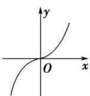
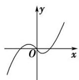
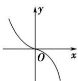
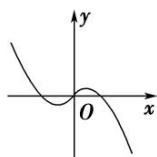

<!-- question-source:start -->
6. 已知函数 $f(x) = x^2 + 2\cos x$ ，若 $f'(x)$ 是 $f(x)$ 的导函数，则函数 $f'(x)$ 的图象大致是（）

A

B

C

D
<!-- question-source:end -->

![[高中/总复习/专题/导数/专题04 函数的单调性-导数/考点一_不含参数的函数的单调性/对点训练/题目/answers/Q00034811A1.md]]
