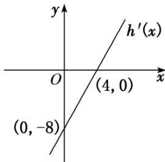

<!-- question-source:start -->
10. 已知二次函数 $h(x)=ax^{2}+bx+2$ ，其导函数 $y=h'(x)$ 的图象如图所示， $f(x)=6\ln x+h(x)$ .

(1)求函数 $f(x)$ 的解析式;

(2)若函数 $f(x)$ 在区间 $\left(1, m + \frac{1}{2}\right)$ 上是单调函数，求实数 $m$ 的取值范围.

<!-- question-source:end -->

![[高中/总复习/专题/导数/专题04 函数的单调性-导数/考点三_根据函数的单调性求参数/对点训练/题目/answers/Q00034824A1.md]]
