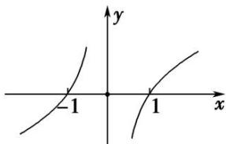

> [!faq]- 《专题06 构造函数法解决导数不等式问题(1)-导数》例题解析
>
> > [!success]- **【答案】** 详见解析
>
> > [!note]- **【分析】**
> > 本题未单列分析。
>
> > [!note]- **【解析】**
> > 答案 $(- \infty, -1) \cup (1, +\infty)$ 解析 构造 $F(x) = \frac{f(x)}{x}$ ，则 $F'(x) = \frac{f'(x) \cdot x - f(x)}{x^2}$ ，当 $x < 0$ 时， $xf'(x) - f(x) > 0$ ，可以推出当 $x < 0$ 时， $F'(x) > 0$ ， $F(x)$ 在 $(- \infty, 0)$ 上单调递增。 $\because f(x)$ 为偶函数， $x$ 为奇函数， $\therefore F(x)$ 为奇函数， $\therefore F(x)$ 在 $(0, +\infty)$ 上也单调递增。根据 $f(1) = 0$ 可得 $F(1) = 0$ ，根据函数的单调性、奇偶性可得函数图象，根据图象可知 $f(x) > 0$ 的解集为 $(- \infty, -1) \cup (1, +\infty)$ .
> > 
