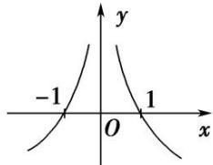

> [!faq]- 《专题06 构造函数法解决导数不等式问题(1)-导数》例题解析
>
> > [!success]- **【答案】** 详见解析
>
> > [!note]- **【解析】**
> > 答案 $(-1, 0) \cup (0, 1)$ 解析 构造 $F(x) = \frac{f(x)}{x^2}$ , 则 $F'(x) = \frac{f'(x) \cdot x - 2f(x)}{x^3}$ , 当 $x > 0$ 时, $xf'(x) - 2f(x) < 0$ , 可以推出当 $x > 0$ 时, $F'(x) < 0$ , $F(x)$ 在 $(0, +\infty)$ 上单调递减. $\because f(x)$ 为偶函数, $x^2$ 为偶函数, $\therefore F(x)$ 为偶函数, $\therefore F(x)$ 在 $(- \infty, 0)$ 上单调递增. 根据 $f(-1) = 0$ 可得 $F(-1) = 0$ , 根据函数的单调性、奇偶性可得函数图象如图所示，根据图象可知 $f(x)>0$ 的解集为 $(-1,0)\cup(0,1)$ .
> >
> > 
