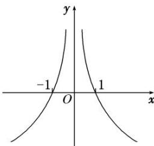

> [!faq]- 教师版例题解析
>
> > [!success]- **【答案】** A
>
> > [!note]- **【分析】**
> > 本题未单列分析。
>
> > [!note]- **【解析】**
> > 答案 A 解析 设 $y=g(x)=\frac{f(x)}{x}(x\neq0)$ ，则 $g'(x)=\frac{xf'(x)-f(x)}{x^{2}}$ ，当 x>0 时， $xf'(x)-f(x)<0$ ， $\therefore g'(x)<0$ ， $\therefore g(x)$ 在 $(0,+\infty)$ 上为减函数，且 $g(1)=f(1)=-f(-1)=0$ 。 $\because f(x)$ 为奇函数， $\therefore g(x)$ 为偶函数， $\therefore g(x)$ 的图象的示意图如图所示。当 x>0 时，由 $f(x)>0$ ，得 $g(x)>0$ ，由图知 0<x<1，当 x<0 时，由 $f(x)>0$ ，得 $g(x)<0$ ，由图知 x<-1， $\therefore$ 使得 $f(x)>0$ 成立的 x 的取值范围是 $(-∞,-1)∪(0,1)$ ，故选 A.
> > 
