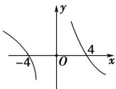

> [!faq]- 教师版例题解析
>
> > [!success]- **【答案】** 详见解析
>
> > [!note]- **【分析】**
> > 本题未单列分析。
>
> > [!note]- **【解析】**
> > 答案 $(- \infty, -4) \cup (0, 4)$ 解析 构造 $F(x) = xf(x)$ ，则 $F'(x) = f(x) + xf'(x)$ ，当 $x < 0$ 时， $f(x) + xf'(x) < 0$ 可以推出当 $x < 0$ 时， $F'(x) < 0$ ， $\therefore F(x)$ 在 $(- \infty, 0)$ 上单调递减。 $\because f(x)$ 为偶函数， $x$ 为奇函数， $\therefore F(x)$ 为奇函数， $\therefore F(x)$ 在 $(0, +\infty)$ 上也单调递减。根据 $f(-4) = 0$ 可得 $F(-4) = 0$ ，根据函数的单调性、奇偶性可得函数图象如图所示，根据图象可知 $xf(x) > 0$ 的解集为 $(- \infty, -4) \cup (0, 4)$ 。
> > 
