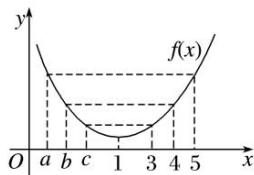
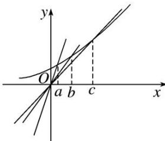

> [!faq]- 教师版对点训练解析
>
> > [!success]- **【答案】** D
>
> > [!note]- **【分析】**
> > 本题未单列分析。
>
> > [!note]- **【解析】**
> > 答案 D 解析 方法一 由已知 $\frac{\mathrm{e}^5}{5} = \frac{\mathrm{e}^a}{a}, \frac{\mathrm{e}^4}{4} = \frac{\mathrm{e}^b}{b}$ ,
> > 
> > $\frac{\mathrm{e}^3}{3} = \frac{\mathrm{e}^c}{c}$ ，设 $f(x) = \frac{\mathrm{e}^x}{x}$ ，则 $f'(x) = \frac{(x - 1)\mathrm{e}^x}{x^2}$ ，所以 $f(x)$ 在 $(0, 1)$ 上单调递减，在 $(1, +\infty)$ 上单调递增，所以 $f(3) < f(4) < f(5)$ ， $f(c) < f(b) < f(a)$ ，所以 $a < b < c$ 。方法二 设 $\mathrm{e}^x = \frac{\mathrm{e}^5}{5} x$ ，①， $\mathrm{e}^x = \frac{\mathrm{e}^4}{4} x$ ，②， $\mathrm{e}^x = \frac{\mathrm{e}^3}{3} x$ ，③， $a, b, c$ 依次为方程①②③的根，结合图象，方程的根可以看作两个图象的交点的横坐标， $\because \frac{\mathrm{e}^5}{5} > \frac{\mathrm{e}^4}{4} > \frac{\mathrm{e}^3}{3}$ ，由图可知 $a < b < c$ 。
> > 
