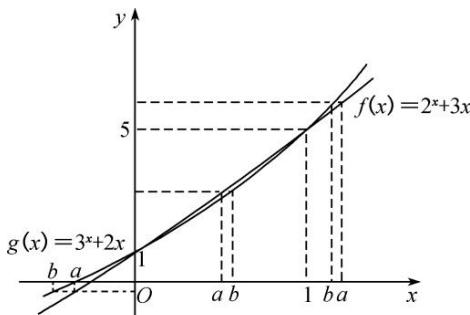

> [!faq]- 《专题07 构造函数法解决导数不等式问题(2)-导数》例题解析
>
> > [!success]- **【答案】** ABD
>
> > [!note]- **【分析】**
> > 本题未单列分析。
>
> > [!note]- **【解析】**
> > 答案 ABD 解析 因为实数 $a, b$ 满足 $2^{a} + 3a = 3^{b} + 2b$ ，所以设 $f(x) = 2^{x} + 3x, g(x) = 3^{x} + 2x$ ，在同一平面直角坐标系中作出 $f(x)$ 与 $g(x)$ 的图象如图所示。由图象可知：①当 $x < 0$ 时， $f(x) < g(x)$ ，所以当 $2^{a} + 3a = 3^{b} + 2b$ 时， $b < a < 0$ ，故 B 正确；
> > - **②**：当 $x = 0$ 或 1 时， $f(x) = g(x)$ ，所以当 $2^{a} + 3a = 3^{b} + 2b$ 时， $a = b = 0$ 或 $a = b = 1$ ，故 D 正确；
> > - **③**：当 $0 < x < 1$ 时， $f(x) > g(x)$ ，所以当 $2^{a} + 3a = 3^{b} + 2b$ 时， $0 < a < b < 1$ ，故 A 正确；
> > - **④**：当 $x > 1$ 时， $f(x) < g(x)$ ，所以当 $2^{a} + 3a = 3^{b} + 2b$ 时， $1 < b < a$ ，故 C 错误。故选 ABD。
> > 
