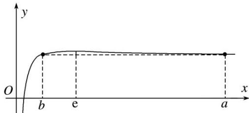

> [!faq]- 《专题07 构造函数法解决导数不等式问题(2)-导数》例题解析
>
> > [!success]- **【答案】** C
>
> > [!note]- **【解析】**
> > 答案 C 解析 由 $a^b = b^a$ 两边取对数得 $b\ln a = a\ln b \Rightarrow \frac{\ln a}{a} = \frac{\ln b}{b}$ . 对于 $y = \frac{\ln x}{x}$ , 由图象易知当 $b < e < a$ 时, 才可能满足题意. 故
> > (1)正确,
> > (2)错误; 另外, 由 $a^b = b^a$ , 令 $a = 4$ , $b = 2$ , 则 $a > e$ , $b < e$ , $ab = 8 > e^2$ , 故
> > (4)正确,
> > (3)错误. 因此, 选 C.
> >
> > 
