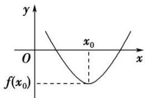
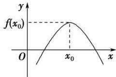
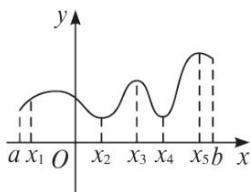

## 专题08 函数的极值

1. 函数的极小值:

函数 $y = f(x)$ 在点 $x = x_0$ 的函数值 $f(x_0)$ 比它在点 $x = x_0$ 附近其他点的函数值都小， $f'(x_0) = 0$ ；而且在点 $x = x_0$ 附近的左侧 $f'(x) < 0$ ，右侧 $f'(x) > 0$ 。则 $x_0$ 叫做函数 $y = f(x)$ 的极小值点， $f(x_0)$ 叫做函数 $y = f(x)$ 的极小值。如图1.

图1

图2

2. 函数的极大值:

函数 $y = f(x)$ 在点 $x = x_0$ 的函数值 $f(x_0)$ 比它在点 $x = x_0$ 附近其他点的函数值都大， $f'(x_0) = 0$ ；而且在点 $x = x_0$ 附近的左侧 $f'(x) > 0$ ，右侧 $f'(x) < 0$ 。则 $x_0$ 叫做函数 $y = f(x)$ 的极大值点， $f(x_0)$ 叫做函数 $y = f(x)$ 的极大值。如图2.

3. 极小值点、极大值点统称为极值点，极小值和极大值统称为极值.

对极值的深层理解：

(1)极值点不是点;

(2)极值是函数的局部性质；

(2)按定义，极值点 $x_{i}$ 是区间 $[a, b]$ 内部的点(如图)，不会是端点a，b；

(3)若 $f(x)$ 在 $(a, b)$ 内有极值，那么 $f(x)$ 在 $(a, b)$ 内绝不是单调函数，即在区间上单调的函数没有极值.

(4)根据函数的极值可知函数的极大值 $f(x_0)$ 比在点 $x_0$ 附近的点的函数值都大，在函数的图象上表现为极大值对应的点是局部的“高峰”；函数的极小值 $f(x_0)$ 比在点 $x_0$ 附近的点的函数值都小，在函数的图象上表现为极小值对应的点是局部的“低谷”。一个函数在其定义域内可以有许多极小值和极大值，在某一点处的极小值也可能大于另一个点处的极大值，极大值与极小值没有必然的联系，即极小值不一定比极大值小，极大值不一定比极小值大；

(5)使 $f'(x)=0$ 的点称为函数 $f(x)$ 的驻点，可导函数的极值点一定是它的驻点。驻点可能是极值点，也可能不是极值点。例如 $f(x)=x^{3}$ 的导数 $f'(x)=3x^{2}$ 在点x=0处有 $f'(0)=0$ ，即x=0是 $f(x)=x^{3}$ 的驻点，但从 $f(x)$ 在 $(-∞,+∞)$ 上为增函数可知，x=0不是 $f(x)$ 的极值点。因此若 $f'(x_{0})=0$ ，则 $x_{0}$ 不一定是极值点，即 $f'(x_{0})=0$ 是 $f(x)$ 在 $x=x_{0}$ 处取到极值的必要不充分条件，函数 $y=f'(x)$ 的变号零点，才是函数的极值点；

(6)函数 $f(x)$ 在 $[a, b]$ 上有极值，极值也不一定不唯一。它的极值点的分布是有规律的，如上图，相邻两个极大值点之间必有一个极小值点，同样相邻两个极小值点之间必有一个极大值点。一般地，当函数 $f(x)$ 在 $[a, b]$ 上连续且有有限个极值点时，函数 $f(x)$ 在 $[a, b]$ 内的极大值点、极小值点是交替出现的。

![[高中/总复习/专题/导数/专题08 函数的极值-导数/专题08_函数的极值/考点一_根据函数图象判断极值/考点一_根据函数图象判断极值.md]]
![[高中/总复习/专题/导数/专题08 函数的极值-导数/专题08_函数的极值/考点二_求已知函数的极值/考点二_求已知函数的极值.md]]
![[高中/总复习/专题/导数/专题08 函数的极值-导数/专题08_函数的极值/考点三_已知函数的极值点求参数/考点三_已知函数的极值点求参数.md]]
