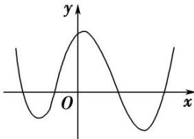
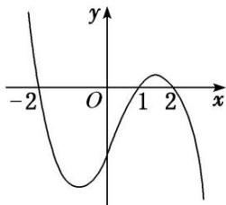
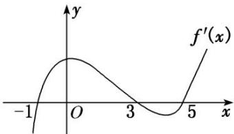
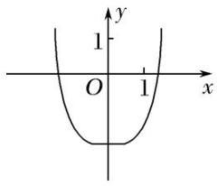
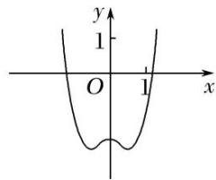
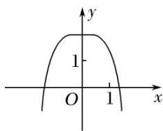
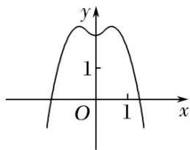

<!-- question-source:start -->
[例 1](1)函数 $f(x)$ 的定义域为 R，导函数 $f'(x)$ 的图象如图所示，则函数 $f(x)$ ( )

A. 无极大值点、有四个极小值点 B. 有三个极大值点、一个极小值点 C. 有两个极大值点、两个极小值点 D. 有四个极大值点、无极小值点

(2)设函数 $f(x)$ 在 $\mathbf{R}$ 上可导，其导函数为 $f'(x)$ ，且函数 $y = (1 - x)f'(x)$ 的图象如图所示，则下列结论中一定成立的是（）

A. 函数 $f(x)$ 有极大值 $f(2)$ 和极小值 $f(1)$ B. 函数 $f(x)$ 有极大值 $f(-2)$ 和极小值 $f(1)$ C. 函数 $f(x)$ 有极大值 $f(2)$ 和极小值 $f(-2)$ D. 函数 $f(x)$ 有极大值 $f(-2)$ 和极小值 $f(2)$

(3)函数 $f(x) = x^{3} + bx^{2} + cx + d$ 的大致图象如图所示， $x_{1}, x_{2}$ 是函数 $y = f(x)$ 的两个极值点，则 $x_{1}^{2} + x_{2}^{2}$ 等于（）

A. $\frac{8}{9}$ B. $\frac{10}{9}$ C. $\frac{16}{9}$ D. $\frac{28}{9}$

(4)已知函数 $y = \frac{f'(x)}{x}$ 的图象如图所示(其中 $f(x)$ 是定义域为 $\mathbf{R}$ 的函数 $f(x)$ 的导函数)，则以下说法错误的是()

A. $f^{\prime}(1) = f^{\prime}(-1) = 0$ B.当 $x = -1$ 时，函数 $f(x)$ 取得极大值C.方程 $xf'(x) = 0$ 与 $f(x) = 0$ 均有三个实数根 D.当 $x = 1$ 时，函数 $f(x)$ 取得极小值

(5)(多选)函数 $y = f(x)$ 导函数的图象如图所示，则下列选项正确的有()

A. $(-1, 3)$ 为函数 $y = f(x)$ 的递增区间 B. (3, 5)为函数 $y = f(x)$ 的递减区间 C. 函数 $y = f(x)$ 在 $x = 0$ 处取得极大值 D. 函数 $y = f(x)$ 在 $x = 5$ 处取得极小值

(6) (2018·全国III)函数 $y = -x^{4} + x^{2} + 2$ 的图象大致为()

A

C

B

D
<!-- question-source:end -->

![[高中/总复习/专题/导数/专题08 函数的极值-导数/专题08_函数的极值/考点一_根据函数图象判断极值/例题选讲/例题/answers/Q00021011A1.md]]
