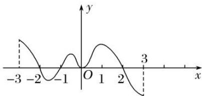

<!-- question-source:start -->
1. 如图是 $f(x)$ 的导函数 $f'(x)$ 的图象，则 $f(x)$ 的极小值点的个数为( )

A. 1 B. 2 C. 3 D. 4
<!-- question-source:end -->

![[高中/总复习/专题/导数/专题08 函数的极值-导数/专题08_函数的极值/考点一_根据函数图象判断极值/对点训练/题目/answers/Q00021012A1.md]]
