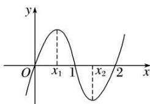

<!-- question-source:start -->
3. 已知函数 $f(x) = x^3 + bx^2 + cx$ 的图象如图所示，则 $x_1^2 + x_2^2$ 等于（）

A. $\frac{2}{3}$ B. $\frac{4}{3}$ C. $\frac{8}{3}$ D. $\frac{16}{3}$
<!-- question-source:end -->

![[高中/总复习/专题/导数/专题08 函数的极值-导数/专题08_函数的极值/考点一_根据函数图象判断极值/对点训练/题目/answers/Q00021014A1.md]]
