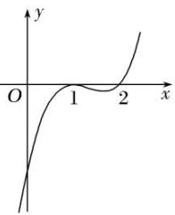
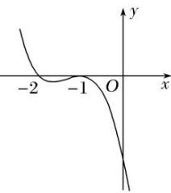
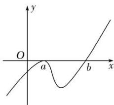
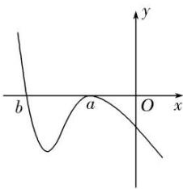

> [!faq]- 教师版例题解析
>
> > [!success]- **【答案】** (1) 1；(2) 11；(3) 1；(4) $a > -1$；(5) C；(6) $(- \infty, -1]$；(7) $\left(0, \frac{1}{2}\right)$；(8) D
>
> > [!note]- **【分析】**
> > 本题未单列分析。
>
> > [!note]- **【解析】**
> > 答案 1 解析 由 $f'(1) = 0$ 可得 $m = 1$ 或 $m = 3$ . 当 $m = 3$ 时, $f'(x) = 3(x - 1)(x - 3)$ , 当 $1 < x < 3$ 时, $f'(x) < 0$ ; 当 $x < 1$ 或 $x > 3$ 时, $f'(x) > 0$ , 此时 $f(x)$ 在 $x = 1$ 处取得极大值, 不合题意, 当 $m = 1$ 时, $f'(x) = (x - 1)(3x - 1)$ . 当 $\frac{1}{3} < x < 1$ 时, $f'(x) < 0$ ; 当 $x < \frac{1}{3}$ 或 $x > 1$ 时, $f'(x) > 0$ , 此时 $f(x)$ 在 $x = 1$ 处取得极小值, 符合题意, 所以 $m = 1$ .
> > 答案 11 解析 $f(x) = 3x^{2} + 6ax + b$ ，由题意得 $\begin{cases} f'(-1) = 0, \\ f(-1) = 0, \end{cases}$ 解得 $\begin{cases} a = 1, \\ b = 3 \end{cases}$ 或 $\begin{cases} a = 2, \\ b = 9, \end{cases}$ 当 $a = 1$ ， $b = 3$ 时， $f'(x) = 3x^{2} + 6x + 3 = 3(x + 1)^{2} \geq 0$ ，∴ $f(x)$ 在 $\mathbf{R}$ 上单调递增，∴ $f(x)$ 无极值，所以 $a = 1$ ， $b = 3$ 不符合题意，当 $a = 2$ ， $b = 9$ 时，经检验满足题意．∴ $a + b = 11$ .
> > 答案 1 解析 因为函数的导数为 $f'(x) = \left\{ x - \frac{5}{2} \right\} (x - k)^k$ ， $k \geq 1$ ， $k \in \mathbf{Z}$ ，所以若 $k$ 是偶数，则 $x = k$ ，不是极值点，则 $k$ 是奇数，若 $k < \frac{5}{2}$ ，由 $f'(x) > 0$ ，解得 $x > \frac{5}{2}$ 或 $x < k$ ；由 $f'(x) < 0$ ，解得 $k < x < \frac{5}{2}$ ，即当 $x = k$ 时，函数 $f(x)$ 取得极大值．因为 $k \in \mathbf{Z}$ ，所以 $k = 1$ ．若 $k > \frac{5}{2}$ ，由 $f'(x) > 0$ ，解得 $x > k$ 或 $x < \frac{5}{2}$ ；由 $f'(x) < 0$ ，解得 $\frac{5}{2} < x < k$ ，即当 $x = k$ 时，函数 $f(x)$ 取得极小值，不满足条件．
> > 答案 $a > -1$ 解析 $f(x)$ 的定义域为 $(0, +\infty)$ , $f'(x) = \frac{1}{x} - ax - b$ , 由 $f'(1) = 0$ , 得 $b = 1 - a$ , 所以 $f'(x)$
> > $= \frac{1}{x} - ax + a - 1 = \frac{-ax^2 + 1 + ax - x}{x} = \frac{-(ax + 1)(x - 1)}{x}$ . ①若 $a \geq 0$ , 当 $0 < x < 1$ 时, $f'(x) > 0$ , $f(x)$ 单调递增; 当 $x > 1$ 时, $f'(x) < 0$ , $f(x)$ 单调递减, 所以 $x = 1$ 是 $f(x)$ 的极大值点. ②若 $a < 0$ , 由 $f'(x) = 0$ , 得 $x = 1$ 或 $x = -\frac{1}{a}$ . 因为 $x = 1$ 是 $f(x)$ 的极大值点, 所以 $-\frac{1}{a} > 1$ , 解得 $-1 < a < 0$ . 综合①②得 $a$ 的取值范围是 $a > -1$ .
> > 答案 C 解析 $f'(x)=ax-(1+2a)+\frac{2}{x}=\frac{ax^{2}-(2a+1)x+2}{x}(a>0,\ x>0)$ ，若 $f(x)$ 在区间 $\left(\frac{1}{2},\ 1\right)$ 内有极大值，即 $f'(x)=0$ 在 $\left(\frac{1}{2},\ 1\right)$ 内有解，且 $f'(x)$ 在区间 $\left(\frac{1}{2},\ 1\right)$ 内先大于 0，后小于 0，则 $\left\{\begin{aligned}\frac{1}{4}a-\frac{1}{2}(2a+1)+2\\ \frac{1}{2}\end{aligned}\right.$ 解得 1<a<2，故选 C.
> > 解得 1<a<2，故选 C.
> > 答案 $(- \infty, -1]$ 解析 函数 $f(x)$ 的定义域为 $(0, +\infty)$ ， $f'(x) = 2x - 1 + \frac{a}{x} = \frac{2x^2 - x + a}{x}$ ，由题意知 $2x^2 - x + a = 0$ 在 $\mathbf{R}$ 上有两个不同的实数解，且在 $[1, +\infty)$ 上有解，所以 $\Delta = 1 - 8a > 0$ ，且 $2 \times 1^2 - 1 + a \leq 0$ ，所以 $a \in (-\infty, -1]$ .
> > 答案 $\left(0, \frac{1}{2}\right)$ 解析 $f(x) = x(\ln x - ax)$ ，定义域为 $(0, +\infty)$ ， $f'(x) = 1 + \ln x - 2ax$ 。由题意知，当 $x > 0$ 时， $1 + \ln x - 2ax = 0$ 有两个不相等的实数根，即 $2a = \frac{1 + \ln x}{x}$ 有两个不相等的实数根，令 $\varphi(x) = \frac{1 + \ln x}{x}(x > 0)$ ， $\therefore \varphi'(x) = \frac{-\ln x}{x^2}$ 。当 $0 < x < 1$ 时， $\varphi'(x) > 0$ ；当 $x > 1$ 时， $\varphi'(x) < 0$ ， $\therefore \varphi(x)$ 在 $(0, 1)$ 上单调递增，在 $(1, +\infty)$ 上单调递减，且 $\varphi(1) = 1$ ，当 $x \to 0$ 时， $\varphi(x) \to -\infty$ ，当 $x \to +\infty$ 时， $\varphi(x) \to 0$ ，则 $0 < 2a < 1$ ，即 $0 < a < \frac{1}{2}$ 。
> > 答案 D 解析 法一 (特殊值法) 当 a=1, b=2 时，函数 $f(x)=(x-1)^{2}(x-2)$ ，画出该函数的图象如图 1 所示，可知 x=1 为函数 $f(x)$ 的极大值点，满足题意。从而，根据 a=1, b=2 可判断选项 B，C 错误；当 a=-1, b=-2 时，函数 $f(x)=-(x+1)^{2}(x+2)$ ，画出该函数的图象如图 2 所示，可知 x=-1 为函数 $f(x)$ 的极大值点，满足题意。从而，根据 a=-1, b=-2 可判断选项 A 错误。
> > 
> > 
> > 图1
> > 图2
> > 法二 (数形结合法)当 a>0 时，根据题意作出函数 $f(x)$ 的大致图象，如图 3 所示，观察可知 b>a.
> > 
> > 图3
> > 当 a<0 时，根据题意作出函数 $f(x)$ 的大致图象，如图 4 所示，观察可知 a>b.
> > 
> > 图 4
> > 综上，可知必有 $ab > a^{2}$ 成立．
> >
> > 故选 **D**.
