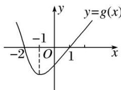

<!-- question-source:start -->
2. 设函数 $f(x)$ 在 $\mathbf{R}$ 上可导, 其导函数为 $f'(x)$ , 且函数 $g(x) = xf'(x)$ 的图象如图所示, 则下列结论中一定成立的是( )

A. $f(x)$ 有两个极值点 B. $f(0)$ 为函数的极大值 C. $f(x)$ 有两个极小值 D. $f(-1)$ 为 $f(x)$ 的极小值
<!-- question-source:end -->

![[高中/总复习/专题/导数/专题08 函数的极值-导数/考点01_根据函数图象判断极值/对点训练/answers/Q00040337A1.md]]
