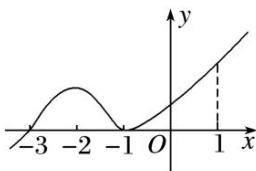

<!-- question-source:start -->
5. (多选)函数 $y=f(x)$ 的导函数 $f'(x)$ 的图象如图所示，则以下命题错误的是()

A. -3 是函数 $y = f(x)$ 的极值点
B. -1 是函数 $y = f(x)$ 的最小值点
C. $y = f(x)$ 在区间 $(-3, 1)$ 上单调递增
D. $y = f(x)$ 在 $x = 0$ 处切线的斜率小于零
<!-- question-source:end -->

![[高中/总复习/专题/导数/专题08 函数的极值-导数/考点01_根据函数图象判断极值/对点训练/answers/Q00040340A1.md]]
