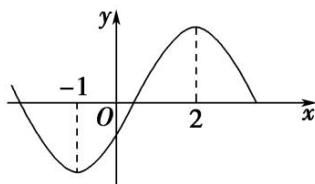

> [!faq]- 《专题08 函数的极值-导数》例题解析
>
> > [!success]- **【答案】** 详见解析
>
> > [!note]- **【分析】**
> > 本题未单列分析。
>
> > [!note]- **【解析】**
> > (1)} = \_$ .
> >
> > 
> >
> > 4. 答案 1 解析 $f(x) = 3ax^2 + 2bx + c$ ，由图象知，方程 $f'(x) = 0$ 的两根为 -1 和 2，则有 $\left\{ \begin{array}{l} -\frac{2b}{3a} = -1 + 2, \\ \frac{c}{3a} = -1 \times 2, \end{array} \right.$ 即 $\left\{ \begin{array}{l} 3a + 2b = 0, \\ 6a + c = 0, \end{array} \right.$ $\therefore \frac{f'(0)}{f'
> > (1)} = \frac{c}{3a + 2b + c} = \frac{c}{c} = 1.$
