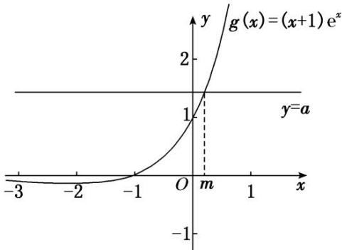

<!-- question-source:start -->
(1) 因为 $f(0)=0$ ， $f'(x)=a-(x+1)e^{x}$ ，所以 $f'(0)=a-1$ ，

所以函数在 $(0, f(0))$ 处的切线方程为 $(a-1)\cdot x-y=0$ .

(2)若证明 $f(x)$ 仅有一个极值点，即证 $f'(x)=a-(x+1)e^{x}=0$ ，只有一个解，

即证 $a = (x + 1)\mathrm{e}^x$ 只有一个解，

令 $g(x)=(x+1)\mathrm{e}^{x}$ ，只需证 $g(x)=(x+1)\mathrm{e}^{x}$ 的图象与直线 $y=a(a>0)$ 仅有一个交点， $g'(x)=(x+2)\mathrm{e}^{x}$ ，当 x=-2 时， $g'(x)=0$ ，

当 x<-2 时， $g'(x)<0$ ， $g(x)$ 单调递减，当 x>-2 时， $g'(x)>0$ ， $g(x)$ 单调递增，

当 $x = -2$ 时， $g(-2) = -\mathrm{e}^{-2} < 0$ 。当 $x \to +\infty$ 时， $g(x) \to +\infty$ ，当 $x \to -\infty$ 时， $g(x) \to 0^{-}$ ，

画出函数 $g(x) = (x + 1)\mathrm{e}^x$ 的图象大致如下，

因为 $a > 0$ ，所以 $g(x) = (x + 1)\mathrm{e}^x$ 的图象与直线 $y = a(a > 0)$ 仅有一个交点．即 $f(x)$ 存在唯一极值点.【对点训练】

1. 函数 $f(x) = 2x - x \ln x$ 的极值是( )
A. $\frac{1}{e}$ B. $\frac{2}{e}$ C. e D. $e^2$
<!-- question-source:end -->

![[高中/总复习/专题/导数/专题08 函数的极值-导数/考点02_求已知函数的极值/例题/answers/Q00050923A1.md]]
