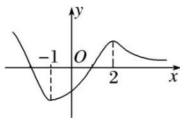

<!-- question-source:start -->
(2)$ 是函数的极大值, 故 B 正确. 又 $f(-1) = -\mathrm{e}$ , $f (2) = \frac{5}{\mathrm{e}^2}$ , 且当 $x \to -\infty$ 时, $f(x) \to +\infty$ , $x \to +\infty$ 时, $f(x) \to 0$ , $\therefore f(x)$ 的图象如图所示, 由图知 C 正确, D 不正确.

10. 若函数 $f(x) = (1 - x)(x^2 + ax + b)$ 的图象关于点 $(-2, 0)$ 对称， $x_1, x_2$ 分别是 $f(x)$ 的极大值点与极小值点，则 $x_2 - x_1 =$ \_\_\_\_.
<!-- question-source:end -->

![[高中/总复习/专题/导数/专题08 函数的极值-导数/考点02_求已知函数的极值/例题/answers/Q00050926A1.md]]
