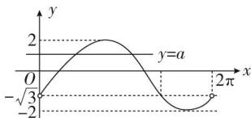

> [!faq]- 《专题08 函数的极值-导数》例题解析
>
> > [!success]- **【答案】** 详见解析
>
> > [!note]- **【分析】**
> > 本题未单列分析。
>
> > [!note]- **【解析】**
> > 解析
> > (1) $\because f(x) = ax + \sqrt{3}\sin x - \cos x, \therefore f'(x) = a + \sqrt{3}\cos x + \sin x,$
> >
> > $$
> > \therefore f ^ {\prime \prime} (x) = - \sqrt {3} \sin x + \cos x, \quad \because f ^ {\prime \prime} \left(x _ {0}\right) = 0, \quad \therefore - \sqrt {3} \sin x _ {0} + \cos x _ {0} = 0.
> > $$
> >
> > 而 $f(x_0) = ax_0 + \sqrt{3}\sin x_0 - \cos x_0 = ax_0$ . $\therefore$ 点 $M(x_0, f(x_0))$ 在直线 $y = ax$ 上.
> >
> > (2)令 $f(x)=0$ ，得 $a=-2\sin\left(x+\frac{\pi}{3}\right)$ ,
> >
> > 作出函数 $y = -2 \sin \left( x + \frac{\pi}{3} \right)$ ， $x \in (0, 2\pi)$ 与函数 y = a 的草图如下所示：
> >
> > 
> >
> > 由图可知，当 $a \geq 2$ 或 $a \leq -2$ 时， $f(x)$ 无极值点；当 $a = -\sqrt{3}$ 时， $f(x)$ 有一个极值点；
> >
> > 当 $-2 < a < -\sqrt{3}$ 或 $-\sqrt{3} < a < 2$ 时， $f(x)$ 有两个极值点.
> >
> > [例 3] (2021·天津高考节选)已知 a>0，函数 $f(x)=ax-x\cdot e^{x}$ .
