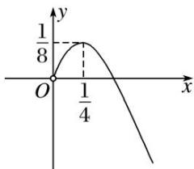

> [!faq]- 《专题08 函数的极值-导数》例题解析
>
> > [!success]- **【答案】** 详见解析
>
> > [!note]- **【解析】**
> > 答案 $\left(-\infty, \frac{1}{8}\right)$ 解析 $f(x)$ 的定义域为 $(0, +\infty)$ ， $f'(x)=2x-1+\frac{a}{x}=\frac{2x^{2}-x+a}{x}$ ，由题意知 $y=f'(x)$ 有变号零点，令 $2x^{2}-x+a=0$ ，即 $a=-2x^{2}+x(x>0)$ ，令 $\varphi(x)=-2x^{2}+x=-2\left(x-\frac{1}{4}\right)^{2}+\frac{1}{8}(x>0)$ ，其图象如图所示，故 $a<\frac{1}{8}$ .
> >
> > 
