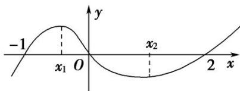

<!-- question-source:start -->
(3)函数 $f(x) = x^{3} + bx^{2} + cx + d$ 的大致图象如图所示， $x_{1}, x_{2}$ 是函数 $y = f(x)$ 的两个极值点，则 $x_{1}^{2} + x_{2}^{2}$ 等于（）

A. $\frac{8}{9}$ B. $\frac{10}{9}$ C. $\frac{16}{9}$ D. $\frac{28}{9}$
<!-- question-source:end -->

![[高中/总复习/专题/导数/专题08 函数的极值-导数/考点一_根据函数图象判断极值/例题选讲/例题/answers/Q00034871A1.md]]
