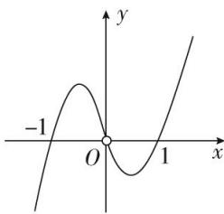

<!-- question-source:start -->
(4)已知函数 $y = \frac{f'(x)}{x}$ 的图象如图所示(其中 $f(x)$ 是定义域为 $\mathbf{R}$ 的函数 $f(x)$ 的导函数)，则以下说法错误的是()

A. $f^{\prime}(1) = f^{\prime}(-1) = 0$ B.当 $x = -1$ 时，函数 $f(x)$ 取得极大值C.方程 $xf'(x) = 0$ 与 $f(x) = 0$ 均有三个实数根 D.当 $x = 1$ 时，函数 $f(x)$ 取得极小值
<!-- question-source:end -->

![[高中/总复习/专题/导数/专题08 函数的极值-导数/考点一_根据函数图象判断极值/例题选讲/例题/answers/Q00034872A1.md]]
