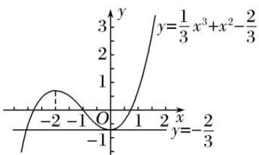

> [!faq]- 教师版对点训练解析
>
> > [!success]- **【答案】** C
>
> > [!note]- **【分析】**
> > 本题未单列分析。
>
> > [!note]- **【解析】**
> > 答案 C 解析 由题意， $f'(x)=x^{2}+2x=x(x+2)$ ，故 $f(x)$ 在 $(-∞, -2)$ ， $(0, +∞)$ 上是增函数，在 $(-2, 0)$ 上是减函数，作出其图象如图所示。令 $\frac{1}{3}x^{3}+x^{2}-\frac{2}{3}=-\frac{2}{3}$ 得，x=0 或 x=-3，则结合图象可知， $\left\{\begin{aligned}-3&\leq a<0,\\ a&+5>0,\end{aligned}\right.$ 解得 $a\in[-3, 0)$ ，故选 C.
> > 
