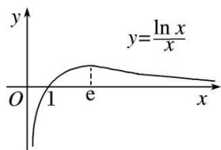

> [!faq]- 教师版例题解析
>
> > [!success]- **【答案】** 详见解析
>
> > [!note]- **【分析】**
> > 本题未单列分析。
>
> > [!note]- **【解析】**
> > 解析 (1)由 $f(x) = \ln x - kx$ 有唯一零点，可得方程 $\ln x - kx = 0$ ，即 $k = \frac{\ln x}{x}$ 有唯一实根，
> > 令 $h(x)=\frac{\ln x}{x}$ ，则 $h'(x)=\frac{1-\ln x}{x^{2}}$ ，由 $h'(x)>0$ ，得 0<x<e；由 $h'(x)<0$ ，得 x>e，
> > ∴ $h(x)$ 在 $(0, e)$ 上单调递增，在 $(e, +\infty)$ 上单调递减．∴ $h(x) \leq h(e) = \frac{1}{e}$ ,
> > 又 $h(1)=0,\quad\therefore$ 当 0<x<1 时， $h(x)<0;$ 又当 x>e 时， $h(x)=\frac{\ln x}{x}>0,$
> > 则 $h(x) = \frac{\ln x}{x}$ 的大致图象如图所示，
> > 
> > 可知， $k=\frac{1}{e}$ 或 $k\leq0$ .
> > (2) $\because x(e^{x}-2)-(\ln x-kx)\geq1$ 恒成立，且 x>0， $\therefore k\geq\frac{1+\ln x}{x}-e^{x}+2$ 恒成立，
> > 令 $\varphi(x) = \frac{1 + \ln x}{x} - e^x + 2$ ，则 $\varphi'(x) = \frac{\frac{1}{x} x - (1 + \ln x)}{x^2} - e^x = \frac{-\ln x - x^2 e^x}{x^2}$ ,
> > 令 $\mu (x) = -\ln x - x^{2}\mathrm{e}^{x}$ ，则 $\mu '(x) = -\frac{1}{x} -(2xe^x +x^2\mathrm{e}^x) = -\frac{1}{x} -xe^x (2 + x) <   0(x > 0),$
> > ∴ $\mu(x)$ 在 $(0, +\infty)$ 上单调递减，又 $\mu\left(\frac{1}{e}\right)=1-\mathrm{e}^{\frac{1}{e}-2}>0,\quad\mu(1)=-\mathrm{e}<0,$
> > 由函数零点存在定理知，存在唯一零点 $x_0 \in \left(\frac{1}{\mathrm{e}}, 1\right)$ ，使 $\mu(x_0) = 0$ ，即 $-\ln x_0 = x_0^2 \mathrm{e}^{x_0}$ ，
> > 两边取对数可得 $\ln(-\ln x_{0})=2\ln x_{0}+x_{0}$ ，即 $\ln(-\ln x_{0})+(-\ln x_{0})=x_{0}+\ln x_{0}$
> > 由函数 $y=x+\ln x$ 为增函数，可得 $x_{0}=-\ln x_{0}$
> > 又当 $0 < x < x_{0}$ 时， $\mu(x) > 0,\quad \varphi'(x) > 0;$ 当 $x > x_{0}$ 时， $\mu(x) < 0,\varphi'(x) < 0,$
> > $\therefore \varphi (x)$ 在 $(0, x_0)$ 上单调递增，在 $(x_0, +\infty)$ 上单调递减，
> > $$
> > \therefore \varphi (x) \leq \varphi (x _ {0}) = \frac {1 + \ln x _ {0}}{x _ {0}} - \mathrm{e} ^ {x _ {0}} + 2 = \frac {1 - x _ {0}}{x _ {0}} - \frac {1}{x _ {0}} + 2 = 1, \quad \therefore k \geq \varphi (x _ {0}) = 1,
> > $$
> > 即 k 的取值范围为 $k \geq 1$ .
