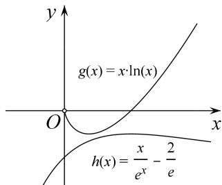

> [!faq]- 教师版例题解析
>
> > [!success]- **【答案】** 详见解析
>
> > [!note]- **【分析】**
> > 本题未单列分析。
>
> > [!note]- **【解析】**
> > 解析 (1) $f'(x)=ae^{x}\left(\ln x+\frac{1}{x}\right)+\frac{be^{x-1}(x-1)}{x^{2}}(x>0)$ ，由于直线 $y=e(x-1)+2$ 的斜率为 e，图象过点 $(1,2)$ ，
> > 所以 $\left\{\begin{aligned}f(1)&=2,\\ f'(1)&=e,\end{aligned}\right.$ 即 $\left\{\begin{aligned}b&=2,\\ ae&=e,\end{aligned}\right.$ 解得 $\left\{\begin{aligned}a&=1,\\ b&=2.\end{aligned}\right.$
> > (2)由(1)知 $f(x) = \mathrm{e}^{x}\ln x + \frac{2\mathrm{e}^{x - 1}}{x} (x > 0)$ ，从而 $f(x) > 1$ 等价于 $x\ln x > x\mathrm{e}^{-x} - \frac{2}{\mathrm{e}}$ .
> > 构造函数 $g(x)=x\ln x$ ，则 $g'(x)=1+\ln x$ ，
> > 所以当 $x \in \begin{pmatrix} 0, & \frac{1}{\mathrm{e}} \end{pmatrix}$ 时， $g'(x) < 0$ ，当 $x \in \begin{pmatrix} \frac{1}{\mathrm{e}}, & +\infty \end{pmatrix}$ 时， $g'(x) > 0$ ，
> > 故 $g(x)$ 在 $\left(0, \frac{1}{e}\right)$ 上单调递减，在 $\left(\frac{1}{e}, +\infty\right)$ 上单调递增，从而 $g(x)$ 在 $(0, +\infty)$ 上的最小值为 $g\left(\frac{1}{e}\right) = -\frac{1}{e}$ .
> > 构造函数 $h(x)=xe^{-x}-\frac{2}{e}$ ，则 $h'(x)=e^{-x}(1-x)$ .
> > 所以当 $x \in (0, 1)$ 时， $h'(x) > 0$ ；当 $x \in (1, +\infty)$ 时， $h'(x) < 0$ ;
> > 故 $h(x)$ 在 $(0, 1)$ 上单调递增，在 $(1, +\infty)$ 上单调递减，从而 $h(x)$ 在 $(0, +\infty)$ 上的最大值为 $h(1) = -\frac{1}{e}$ . 综上，当 x > 0 时， $g(x) > h(x)$ ，即 $f(x) > 1$ .
> > 
