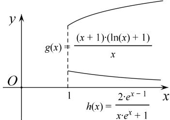
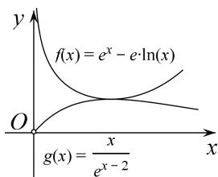

> [!faq]- 教师版对点精练解析
>
> > [!success]- **【答案】** 详见解析
>
> > [!note]- **【分析】**
> > 本题未单列分析。
>
> > [!note]- **【解析】**
> > 解析 将不等式 $\frac{f(x)}{\mathrm{e} + 1} > \frac{2\mathrm{e}^{x - 1}}{(x + 1)(x\mathrm{e}^x + 1)}$ 变形为 $\frac{1}{\mathrm{e} + 1}\cdot \frac{(x + 1)(\ln x + 1)}{x} > \frac{2\mathrm{e}^{x - 1}}{x\mathrm{e}^x + 1},$
> > 分别构造函数 $g(x)=\frac{(x+1)(\ln x+1)}{x}$ 和函数 $h(x)=\frac{2e^{x-1}}{xe^{x}+1}$ .
> > 对于 $g'(x)=\frac{x-\ln x}{x^{2}}$ ，令 $\varphi(x)=x-\ln x$ ，则 $\varphi'(x)=1-\frac{1}{x}=\frac{x-1}{x}$ .
> > 因为 x>1，所以 $\varphi'(x)>0$ ，所以 $\varphi(x)$ 在 $(1, +\infty)$ 上是增函数，所以 $\varphi(x)>\varphi(1)=1>0$ ，
> > 所以 $g'(x)>0$ ，所以 $g(x)$ 在 $(1, +\infty)$ 上是增函数，所以当 x>1 时， $g(x)>g(1)=2$ ，故 $\frac{g(x)}{e+1}>\frac{2}{e+1}$ 对于 $h'(x)=\frac{2\mathrm{e}^{x-1}(1-\mathrm{e}^x)}{(x\mathrm{e}^x+1)^2}$ ，因为 x>1，所以 $1-e^{x}<0$ ，所以 $h'(x)<0$ ，
> > 所以 $h(x)$ 在 $(1, +\infty)$ 上是减函数，所以当 x>1 时， $h(x)<h(1)=\frac{2}{e+1}$ .
> > 综上所述，当 x>1 时， $\frac{g(x)}{e+1}>h(x)$ ，即 $\frac{f(x)}{e+1}>\frac{2e^{x-1}}{(x+1)(xe^{x}+1)}$ .
> > 
> > (第1题)
> > 
> > (第2题)
