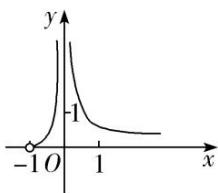
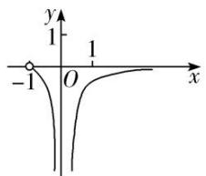
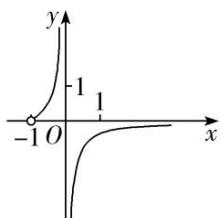
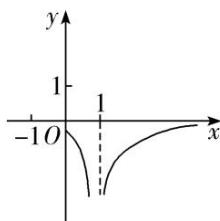

<!-- question-source:start -->
[例2] (1)已知函数 $f(x) = \frac{1}{\ln(x + 1) - x}$ ，则 $y = f(x)$ 的图象大致为（）

A

B

C

D
<!-- question-source:end -->

![[高中/总复习/专题/导数/专题14 两个经典不等式的应用-导数/考点02_经典不等式的变形不等式的应用/例题/answers/Q00040487A1.md]]
