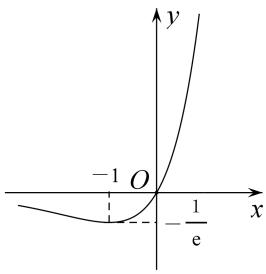
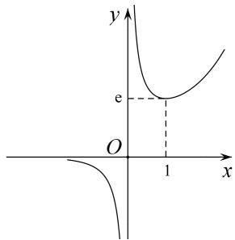
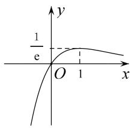
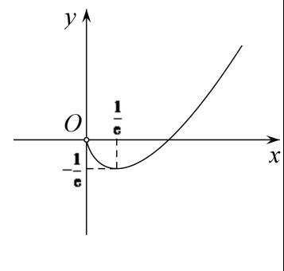
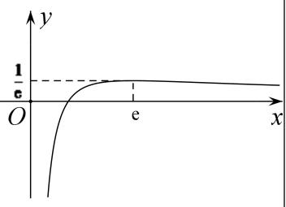
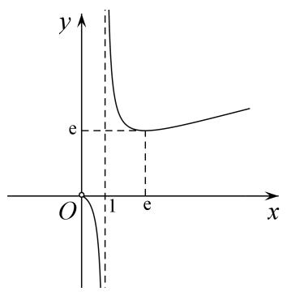

## 六大经典超越函数的图象

<table><tr><td>函数</td><td> $f(x)=xe^x$ </td><td> $f(x)=\frac{e^x}{x}$ </td><td> $f(x)=\frac{x}{e^x}$ </td></tr><tr><td>图象</td><td></td><td></td><td></td></tr><tr><td>函数</td><td> $f(x)=x\ln x$ </td><td> $f(x)=\frac{\ln x}{x}$ </td><td> $f(x)=\frac{x}{\ln x}$ </td></tr><tr><td>图象</td><td colspan="3"> —  </td></tr></table>
