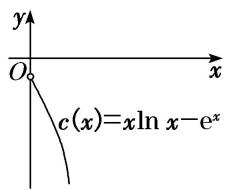
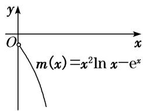
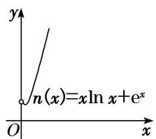
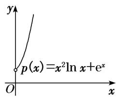
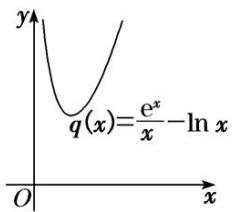
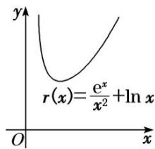

## 考点三 x与ex，lnx的组合函数问题

(1)熟悉函数 $f(x) = h(x)\ln x \pm e^{x}(h(x) = ax^{2} + bx + c(a, b \text{不能同时为 } 0))$ 的图形特征，做到对图(1)(2)(3)(4)所示的特殊函数的图象“有形可寻”.

(1)

(3)

(2)

(4)

(2)熟悉函数 $f(x) = \frac{\mathrm{e}^x}{h(x)} \pm \ln x$ (其中 $h(x) = ax^2 + bx + c(a, b \text{ 不同时为 } 0)$ ) 的图形特征，做到对图(5)(6)所示的两个特殊函数的图象“有形可寻”.

(5)

(6)

![[高中/总复习/专题/导数/专题16 导数中有关x与ex，lnx的组合函数问题-导数/考点三_x与ex_lnx的组合函数问题/命题点1_分离参数设而不求/命题点1_分离参数设而不求.md]]
![[高中/总复习/专题/导数/专题16 导数中有关x与ex，lnx的组合函数问题-导数/考点三_x与ex_lnx的组合函数问题/命题点2_分离lnx与ex/命题点2_分离lnx与ex.md]]
![[高中/总复习/专题/导数/专题16 导数中有关x与ex，lnx的组合函数问题-导数/考点三_x与ex_lnx的组合函数问题/对点训练/对点训练.md]]
