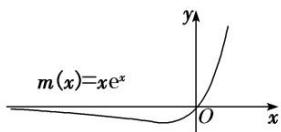
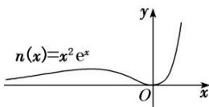
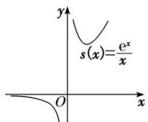
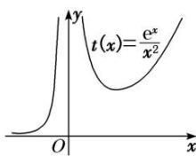

## 考点二 x与ex的组合函数问题

(1)熟悉函数 $f(x) = h(x)\mathrm{e}^{g(x)}(g(x))$ 为一次函数， $h(x) = ax^{2} + bx + c(a, b \text{不能同时为 } 0))$ 的图象特征，做到对图(1)(2)中两个特殊函数的图象“有形可寻”.

(1)

(2)

(2)熟悉函数 $f(x) = \frac{\mathrm{e}^x}{h(x)} (h(x) = ax^2 + bx + c (a, b \text{不能同时为 } 0), h(x) \neq 0)$ 的图象特征，做到对图(3)(4)中两个特殊函数的图象“有形可寻”.

(3)

(4)

![[高中/总复习/专题/导数/专题16 导数中有关x与ex，lnx的组合函数问题-导数/考点二_x与ex的组合函数问题/例题选讲/例题选讲.md]]
