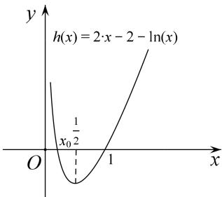
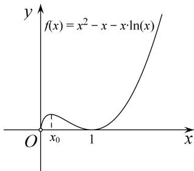

> [!faq]- 教师版例题解析
>
> > [!success]- **【答案】** 详见解析
>
> > [!note]- **【分析】**
> > 本题未单列分析。
>
> > [!note]- **【解析】**
> > 解析 (1) $f(x)$ 的定义域为 $(0, +\infty)$ . 设 $g(x)=ax-a-\ln x$ ，则 $f(x)=xg(x)$ ， $f(x)\geq0$ 等价于 $g(x)\geq0$ .
> > 因为 $g(1)=0,\quad g(x)\geq0$ ，故 $g'(1)=0$ ，而 $g'(x)=a-\frac{1}{x}$ ， $g'(1)=a-1$ ，得 a=1。
> > 若 $a = 1$ ，则 $g'(x) = 1 - \frac{1}{x}$ 当 $0 < x < 1$ 时， $g'(x) < 0$ ， $g(x)$ 单调递减；当 $x > 1$ 时， $g'(x) > 0$ ， $g(x)$ 单调递增.
> > 所以 x=1 是 $g(x)$ 的极小值点，故 $g(x)\geq g(1)=0$ 。综上，a=1。
> > (2)由(1)知 $f(x)=x^{2}-x-x\ln x,\quad f'(x)=2x-2-\ln x.$
> > 设 $h(x)=2x-2-\ln x$ ，则 $h'(x)=2-\frac{1}{x}$ 。当 $x\in\left(0,\frac{1}{2}\right)$ 时， $h'(x)<0$ ；当 $x\in\left(\frac{1}{2},+\infty\right)$ 时， $h'(x)>0$ 。
> > 所以 $h(x)$ 在 $\left(0, \frac{1}{2}\right)$ 单调递减，在 $\left(\frac{1}{2}, +\infty\right)$ 单调递增．又 $h(e^{-2})>0,\quad h\left(\frac{1}{2}\right)<0,\quad h(1)=0,$
> > 所以 $h(x)$ 在 $\left(0, \frac{1}{2}\right)$ 有唯一零点 $x_{0}$ ，在 $\left[\frac{1}{2}, +\infty\right)$ 有唯一零点 1，且当 $x \in (0, x_0)$ 时， $h(x) > 0$ ；当 $x \in (x_0, 1)$ 时， $h(x) < 0$ ；当 $x \in (1, +\infty)$ 时， $h(x) > 0$ 。因为 $f'(x) = h(x)$ ，所以 $x = x_0$ 是 $f(x)$ 的唯一极大值点。由 $f'(x_0) = 0$ 得 $\ln x_0 = 2(x_0 - 1)$ ，故 $f(x_0) = x_0(1 - x_0)$ 。由 $x_0 \in (0, 1)$ 得 $f(x_0) < \frac{1}{4}$ 。因为 $x = x_0$ 是 $f(x)$ 在 $(0, 1)$ 的最大值点，由 $\mathrm{e}^{-1} \in (0, 1)$ ， $f'(\mathrm{e}^{-1}) \neq 0$ 得 $f(x_0) > f(\mathrm{e}^{-1}) = \mathrm{e}^{-2}$ ，所以 $\mathrm{e}^{-2} < f(x_0) < 2^{-2}$ 。
> > 
> > 
