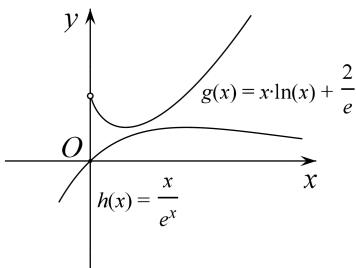
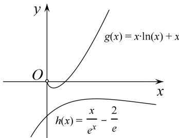

> [!faq]- 教师版例题解析
>
> > [!success]- **【答案】** 详见解析
>
> > [!note]- **【分析】**
> > 本题未单列分析。
>
> > [!note]- **【解析】**
> > 解析 (1)由题意，得 $g(x) = x \cdot f(x) = x \ln x + \frac{2}{\mathrm{e}} (x > 0)$ ，则 $g'(x) = \ln x + 1$
> > 当 $x \in \begin{bmatrix} 0, & \frac{1}{\mathrm{e}} \end{bmatrix}$ 时， $g'(x) < 0$ ，所以 $g(x)$ 单调递减；当 $x \in \begin{bmatrix} \frac{1}{\mathrm{e}}, & +\infty \end{bmatrix}$ 时， $g'(x) > 0$ ，所以 $g(x)$ 单调递增，所以 $g(x)$ 的单调递减区间为 $\begin{bmatrix} 0, & \frac{1}{\mathrm{e}} \end{bmatrix}$ ，单调递增区间为 $\begin{bmatrix} \frac{1}{\mathrm{e}}, & +\infty \end{bmatrix}$ ，
> > 所以 $g(x)$ 的极小值为 $g\left(\frac{1}{e}\right)=\frac{1}{e}$ ，无极大值.
> > (2)要证 $\ln x + \frac{2}{\mathrm{e}x} > \frac{1}{\mathrm{e}^{x}} (x > 0)$ 成立，只需证 $x \ln x + \frac{2}{\mathrm{e}} > \frac{x}{\mathrm{e}^{x}} (x > 0)$ 成立，令 $h(x) = \frac{x}{\mathrm{e}^{x}}$ ，则 $h'(x) = \frac{1 - x}{\mathrm{e}^{x}}$ ，当 $x \in (0, 1)$ 时， $h'(x) > 0$ ， $h(x)$ 单调递增，当 $x \in (1, +\infty)$ 时， $h'(x) < 0$ ， $h(x)$ 单调递减，所以 $h(x)$ 的极大值为 $h(1)$ ，即 $h(x) \leq h(1) = \frac{1}{\mathrm{e}}$ ，
> > 由(1)知， $x\in(0,+\infty)$ 时， $g(x)\geq g\left(\frac{1}{\mathrm{e}}\right)=\frac{1}{\mathrm{e}}$
> > 且 $g(x)$ 的最小值点与 $h(x)$ 的最大值点不同，所以 $x \ln x + \frac{2}{e} > \frac{x}{e^{x}}$ ，即 $\ln x + \frac{2}{ex} > \frac{1}{e^{x}}$ ，所以 $f(x) > \frac{1}{e^{x}}$ .
> > 
> > 
> > (例 3 图)
> > (例 4 图)
