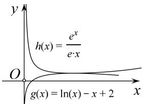

> [!faq]- 教师版对点精练解析
>
> > [!success]- **【答案】** 详见解析
>
> > [!note]- **【分析】**
> > 本题未单列分析。
>
> > [!note]- **【解析】**
> > 解析 (1) $f'(x)=\frac{e}{x}-a(x>0)$ ,
> > - **①**：若 $a \leq 0$ ，则 $f'(x) > 0$ ， $f(x)$ 在 $(0, +\infty)$ 上单调递增；
> > - **②**：若 a>0，则当 $0<x<\frac{e}{a}$ 时， $f(x)>0$ ；当 $x>\frac{e}{a}$ 时， $f'(x)<0$ ，
> > 故 $f(x)$ 在 $\left[0, \frac{e}{a}\right]$ 上单调递增，在 $\left[\frac{e}{a}, +\infty\right]$ 上单调递减.
> > (2)证法一：因为 $x > 0$ ，所以只需证 $f(x)\leq \frac{\mathrm{e}^x}{x} -2\mathrm{e},$
> > 当 $a = \mathrm{e}$ 时，由(1)知， $f(x)$ 在(0，1)上单调递增，在 $(1, +\infty)$ 上单调递减，所以 $f(x)_{\max} = f(1) = -\mathrm{e}$ .
> > 记 $g(x)=\frac{e^{x}}{x}-2e(x>0)$ ，则 $g'(x)=\frac{(x-1)e^{x}}{x^{2}}$ ,
> > 所以当 0 < x < 1 时， $g'(x) < 0$ ， $g(x)$ 单调递减；当 x > 1 时， $g'(x) > 0$ ， $g(x)$ 单调递增，所以 $g(x)_{\min} = g(1) = -e$ 。综上，当 x > 0 时， $f(x) \leq g(x)$ ，即 $f(x) \leq \frac{e^{x}}{x} - 2e$ ，即 $xf(x) - e^{x} + 2ex \leq 0$ 。
> > 
> > 证法二：由题意知，即证 $ex\ln x - ex^{2} - e^{x} + 2ex \leq 0$ ，从而等价于 $\ln x - x + 2 \leq \frac{e^{x}}{ex}$ .
> > 设函数 $g(x)=\ln x-x+2$ ，则 $g'(x)=\frac{1}{x}-1$ 。所以当 $x\in(0,1)$ 时， $g'(x)>0$ ；当 $x\in(1,+\infty)$ 时， $g'(x)<0$ ，故 $g(x)$ 在 $(0,1)$ 上单调递增，在 $(1,+\infty)$ 上单调递减，从而 $g(x)$ 在 $(0,+\infty)$ 上的最大值为 $g(1)=1$ 。设函数 $h(x)=\frac{\mathrm{e}^{x}}{\mathrm{e}x}$ ，则 $h'(x)=\frac{\mathrm{e}^{x}(x-1)}{\mathrm{e}x^{2}}$ 。所以当 $x\in(0,1)$ 时， $h'(x)<0$ ；当 $x\in(1,+\infty)$ 时， $h'(x)>0$ ，故 $h(x)$ 在 $(0,1)$ 上单调递减，在 $(1,+\infty)$ 上单调递增，从而 $h(x)$ 在 $(0,+\infty)$ 上的最小值为 $h(1)=1$ 。综上，当 x>0 时， $g(x)\leq h(x)$ ，即 $xf(x)-\mathrm{e}^{x}+2\mathrm{e}x\leq0$ 。
> > 
