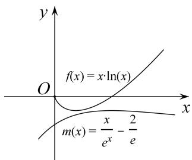

> [!faq]- 教师版对点精练解析
>
> > [!success]- **【答案】** 详见解析
>
> > [!note]- **【分析】**
> > 本题未单列分析。
>
> > [!note]- **【解析】**
> > 解析 (1)由 $f(x)=x \ln x$ ，x>0，得 $f'(x)=\ln x+1$ ，令 $f'(x)=0$ ，得 $x=\frac{1}{e}$ .
> > 当 $x \in (0, \frac{1}{\mathbf{e}})$ 时， $f'(x) < 0$ ， $f(x)$ 单调递减；当 $x \in (\frac{1}{\mathbf{e}}, +\infty)$ 时， $f(x) > 0$ ， $f(x)$ 单调递增.
> > - **①**：当 $0 < t < \frac{1}{e} < t + 2$ ，即 $0 < t < \frac{1}{e}$ 时， $f(x)_{\min} = f(\frac{1}{e}) = -\frac{1}{e}$ ;
> > - **②**：当 $\frac{1}{\mathrm{e}} \leq t < t + 2$ ，即 $t \geq \frac{1}{\mathrm{e}}$ 时， $f(x)$ 在 $[t, t + 2]$ 上单调递增， $f(x)_{\min} = f(t) = t \ln t$ .
> > 所以 $f(x)_{\min}=\left\{\begin{aligned}-\frac{1}{e},&0<t<\frac{1}{e},\\ t\ln t,&t\geq\frac{1}{e}.\end{aligned}\right.$
> > (2)问题等价于证明 $x \ln x > \frac{x}{e^{x}} - \frac{2}{e}(x \in (0, +\infty))$ .
> > 由(1)可知 $f(x)=x\ln x(x\in(0,+\infty))$ 的最小值是 $-\frac{1}{e}$ ，当且仅当 $x=\frac{1}{e}$ 时取到.
> > 设 $m(x) = \frac{x}{\mathrm{e}^x} -\frac{2}{\mathrm{e}} (x\in (0, + \infty))$ ，则 $m^{\prime}(x) = \frac{1 - x}{\mathrm{e}^{x}},$
> > 由 $m'(x)<0$ 得 x>1 时， $m(x)$ 为减函数，由 $m'(x)>0$ 得 0<x<1 时， $m(x)$ 为增函数，
> > 易知 $m(x)_{\max} = m(1) = -\frac{1}{\mathrm{e}}$ ，当且仅当 $x = 1$ 时取到.
> > 从而对一切 $x \in (0, +\infty)$ ， $x \ln x \geq -\frac{1}{e} \geq \frac{x}{e^x} - \frac{2}{e}$ ，两个等号不同时取到，
> > 即证对一切 $x \in (0, +\infty)$ 都有 $\ln x > \frac{1}{e^{x}} - \frac{2}{ex}$ 成立.
> > 
