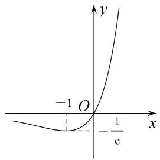
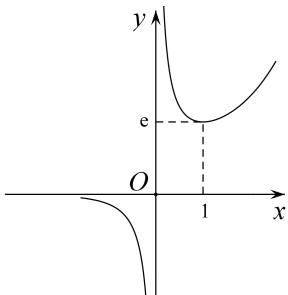
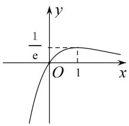
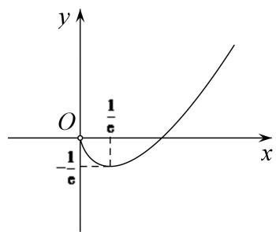
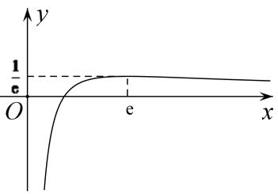
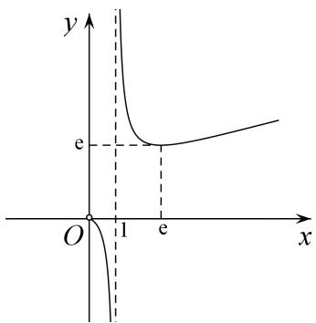

### 1. x与ex的组合函数的图象与性质

## 1. $x$ 与 $\mathrm{e}^x$ 的组合函数的图象与性质

<table><tr><td>函数</td><td> $f(x)=xe^x$ </td><td> $f(x)=\frac{e^x}{x}$ </td><td> $f(x)=\frac{x}{e^x}$ </td></tr><tr><td>图象</td><td></td><td></td><td></td></tr><tr><td>定义域</td><td>R</td><td> $(-∞,0)∪(0,+∞)$ </td><td>R</td></tr><tr><td>值域</td><td> $\left[-\frac{1}{e},+\infty\right]$ </td><td> $(-∞,0)∪[(e,+∞)$ </td><td> $(-∞,\frac{1}{e}]$ </td></tr><tr><td>单调性</td><td>在 $(-∞,-1)$ 上递减在 $(-1,+∞)$ 上递增</td><td>在 $(-∞,0),(0,1)$ 上递减在 $(1,+∞)$ 上递增</td><td>在 $(-∞,1)$ 上递增在 $(1,+∞)$ 上递减</td></tr><tr><td>最值</td><td> $f(x)_{\min}=f(-1)=-\frac{1}{e}$ </td><td>当x&gt;0时, $f(x)_{\min}=f(1)=\frac{1}{e}$ </td><td> $f(x)_{\max}=f(1)=\frac{1}{e}$ </td></tr></table>

2. $x$ 与 $\ln x$ 的组合函数的图象与性质

<table><tr><td>函数</td><td> $f(x)=x\ln x$ </td><td> $f(x)=\frac{\ln x}{x}$ </td><td> $f(x)=\frac{x}{\ln x}$ </td></tr><tr><td>图象</td><td></td><td>— </td><td></td></tr><tr><td>定义域</td><td>(0, +∞)</td><td>(0, +∞)</td><td>(0, 1)∪(1, +∞)</td></tr><tr><td>值域</td><td> $\left[-\frac{1}{e},+\infty\right]$ </td><td>(-∞,  $\frac{1}{e}$ )</td><td>(-∞, 0)∪[e, +∞)</td></tr><tr><td>单调性</td><td>在(0,  $\frac{1}{e}$ )上递减在( $\frac{1}{e}$ , +∞)上递增</td><td>在(0, e)上递增在(e, +∞)上递减</td><td>在(0, 1), (1, e)上递减在(e, +∞)上递增</td></tr><tr><td>最值</td><td> $f(x)_{\min}=f(\frac{1}{e})=-\frac{1}{e}$ </td><td> $f(x)_{\max}=f(e)=\frac{1}{e}$ </td><td>当x&gt;0时, $f(x)_{\min}=f(e)=e$ </td></tr></table>
