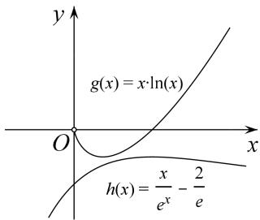
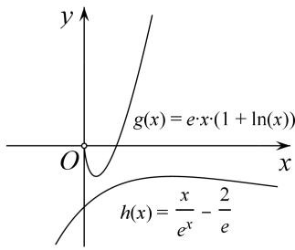

> [!faq]- 教师版例题解析
>
> > [!success]- **【答案】** 详见解析
>
> > [!note]- **【分析】**
> > 本题未单列分析。
>
> > [!note]- **【解析】**
> > 解析 $(1)f'(x) = ae^{x\left(\ln x + \frac{1}{x}\right)} + \frac{be^{x - 1}(x - 1)}{x^2} (x > 0)$ ，由于切线 $y = e(x - 1) + 2$ 的斜率为 $e$ ，图象过点(1,2)，所以 $\begin{cases} f(1) = 2, \\ f'(1) = e, \end{cases}$ 即 $\begin{cases} b = 2, \\ ae = e, \end{cases}$ 解得 $\begin{cases} a = 1, \\ b = 2. \end{cases}$
> > (2)由(1)知 $f(x) = \mathrm{e}^{x}\ln x + \frac{2\mathrm{e}^{x - 1}}{x} (x > 0)$ ，从而 $f(x) > 1$ 等价于 $x\ln x > x\mathrm{e}^{-x} - \frac{2}{\mathrm{e}}$ .
> > 构造函数 $g(x)=x\ln x$ ，则 $g'(x)=1+\ln x$ ，
> > 所以当 $x \in \begin{pmatrix} 0, & \frac{1}{\mathrm{e}} \end{pmatrix}$ 时， $g'(x) < 0$ ，当 $x \in \begin{pmatrix} \frac{1}{\mathrm{e}}, & +\infty \end{pmatrix}$ 时， $g'(x) > 0$ ，
> > 故 $g(x)$ 在 $\begin{pmatrix}0,&\frac{1}{e}\end{pmatrix}$ 上单调递减，在 $\begin{pmatrix}\frac{1}{e},&+\infty\end{pmatrix}$ 上单调递增，
> > 从而 $g(x)$ 在 $(0, +\infty)$ 上的最小值为 $g\left(\frac{1}{e}\right) = -\frac{1}{e}$ .
> > 构造函数 $h(x) = x\mathrm{e}^{-x} - \frac{2}{\mathrm{e}}$ ，则 $h^{\prime}(x) = \mathrm{e}^{-x}(1 - x).$
> > 所以当 $x \in (0, 1)$ 时， $h'(x) > 0$ ；当 $x \in (1, +\infty)$ 时， $h'(x) < 0$ ;
> > 故 $h(x)$ 在 $(0, 1)$ 上单调递增，在 $(1, +\infty)$ 上单调递减，从而 $h(x)$ 在 $(0, +\infty)$ 上的最大值为 $h(1) = -\frac{1}{e}$ . 综上，当 x > 0 时， $g(x) > h(x)$ ，即 $f(x) > 1$ .
> > 
> > 
> > (例 1 图)
> > (例 2 图)
