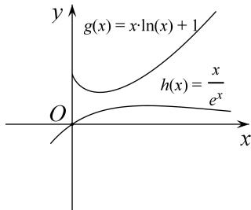

> [!faq]- 《专题18 单变量不含参不等式证明方法之凹凸反转-导数》例题解析
>
> > [!success]- **【答案】** 详见解析
>
> > [!note]- **【分析】**
> > 本题未单列分析。
>
> > [!note]- **【解析】**
> > (1)当 $a = -2$ 时，求 $f(x)$ 的极值；
> > (2)当 $a = 1$ 时，证明： $f(x) - \frac{1}{e^x} + x > 0$ 在 $(0, +\infty)$ 上恒成立.
> > 3. 解析
> > (1) 当 $a = -2$ 时， $f(x) = \ln x - \frac{2}{x} - x, f'(x) = \frac{1}{x} + \frac{2}{x^2} - 1 = -\frac{(x - 2)(x + 1)}{x^2}$ ，
> > ∴ 当 $x \in (0, 2)$ 时， $f'(x) > 0$ ；当 $x \in (2, +\infty)$ 时， $f'(x) < 0$
> > $\therefore f(x)$ 在 $(0, 2)$ 上单调递增，在 $(2, +\infty)$ 上单调递减；
> > ∴ $f(x)$ 在 x=2 处取得极大值 $f
> > (2)=\ln2-3$ ， $f(x)$ 无极小值；
> > (2)当 $a = 1$ 时， $f(x) - \frac{1}{e^x} + x = \ln x + \frac{1}{x} - \frac{1}{e^x}$ ，下面证 $\ln x + \frac{1}{x} > \frac{1}{e^x}$ ，即证 $x \ln x + 1 > \frac{x}{e^x}$ ，设 $g(x) = x \ln x + 1$ ，则 $g'(x) = 1 + \ln x$ ，
> > 在 $(0,\ \frac{1}{e})$ 上， $g'(x)<0,\ \ g(x)$ 是减函数；在 $(\frac{1}{e},+\infty)$ 上， $g'(x)>0,\ \ g(x)$ 是增函数。
> > 所以 $g(x)\geqslant g(\frac{1}{e})=1-\frac{1}{e}$ 设 $h(x)=\frac{x}{e^{x}}$ ，则 $h'(x)=\frac{1-x}{e^{x}}$ 在 $(0,1)$ 上， $h'(x)>0,\ h(x)$ 是增函数；在 $(1,+\infty)$ 上， $h'(x)<0,\ h(x)$ 是减函数，
> > 所以 $h(x)\leqslant h
> > (1)=\frac{1}{e}<1-\frac{1}{e}$ 所以 $h(x)<g(x)$ ，即 $\frac{x}{e^{x}}<x\ln x+1$ ，所以 $x\ln x+1-\frac{x}{e^{x}}>0$ ，即 $\ln x+\frac{1}{x}-\frac{1}{e^{x}}>0$ ，
> > 即 $f(x)-\frac{1}{e^{x}}+x>0$ 在 $(0,+\infty)$ 上恒成立.
> > 
